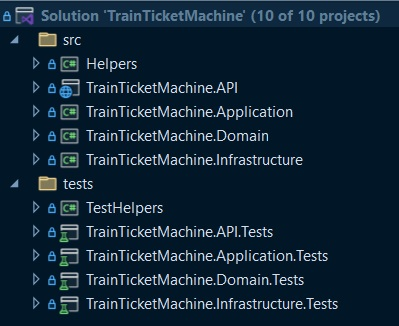

# System Architecture

The Train Ticket Machine API is built using a layered architecture to ensure a clear separation of concerns, ease of maintenance, scalability, and testability. The system is organized into several primary layers.
  
</img>
   

References between the layers

   

Solution folder structure

