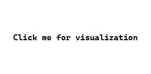
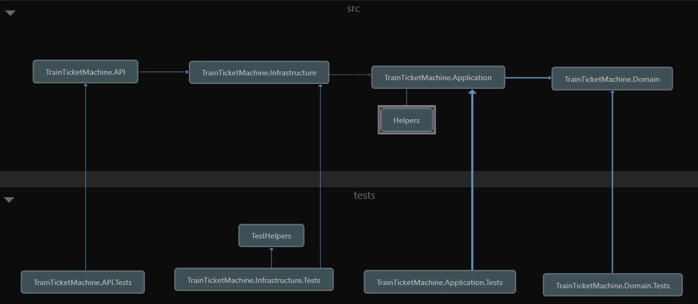

# System Architecture

The Train Ticket Machine API is built using a layered architecture to ensure a clear separation of concerns, ease of maintenance, scalability, and testability. The system is organized into several primary layers.
  
</img>
   

References between the layers

   

# Technical Components and Dependencies

### NuGet Packages
- **Microsoft.AspNetCore.Mvc**  
  *For building the RESTful API endpoints.*

- **Microsoft.AspNetCore.Mvc.Testing**  
  *Provides the `WebApplicationFactory` used for integration testing of the API.*

- **Microsoft.Extensions.Hosting**  
  *Used for hosting and running the application, including background services.*

- **Serilog**  
  *A robust, structured logging library used throughout the application.*

- **Serilog.AspNetCore**  
  *Integrates Serilog with ASP.NET Core for enhanced logging capabilities.*

- **Moq**  
  *A popular mocking framework for unit testing to simulate dependencies.*

- **xUnit**  
  *The testing framework used for unit tests across the project.*

- **coverlet.msbuild**  
  *A tool for code coverage analysis to ensure high test coverage.*

### Additional Tools and Technologies

- **Git**  
  *Used for source control and versioning of the entire project.*

### Other Notable Components
- **Trie Data Structure Implementation**  
  *Custom classes (`StationTrie`, `TrieNode`) for fast, efficient station name lookup and auto-completion.*

- **Custom Input Sanitization**  
  *The `CleanName` function that removes special characters (that are not inputtable on a touch panel) and standardizes spaces to ensure accurate searching and data display.*

- **Background Update Service**  
  *`StationUpdateDatabaseService` that periodically updates the station database and rebuilds the Trie to keep data current.*